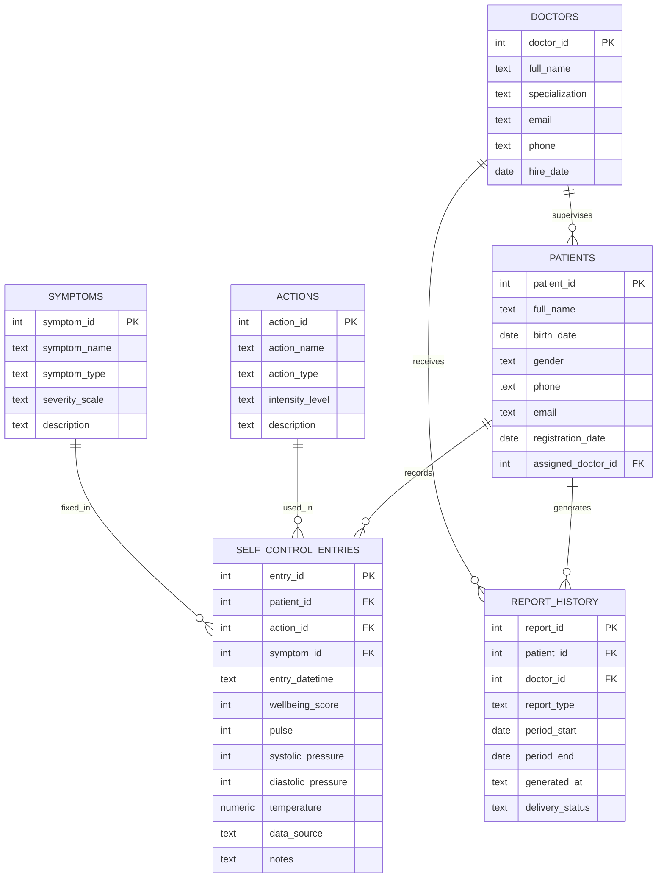

# ER-модель

```mermaid
erDiagram
    DOCTORS ||--o{ PATIENTS : supervises
    PATIENTS ||--o{ SELF_CONTROL_ENTRIES : records
    ACTIONS ||--o{ SELF_CONTROL_ENTRIES : used_in
    SYMPTOMS ||--o{ SELF_CONTROL_ENTRIES : fixed_in
    PATIENTS ||--o{ REPORT_HISTORY : generates
    DOCTORS ||--o{ REPORT_HISTORY : receives

    DOCTORS {
        int doctor_id PK
        text full_name
        text specialization
        text email
        text phone
        date hire_date
    }

    PATIENTS {
        int patient_id PK
        text full_name
        date birth_date
        text gender
        text phone
        text email
        date registration_date
        int assigned_doctor_id FK
    }

    ACTIONS {
        int action_id PK
        text action_name
        text action_type
        text intensity_level
        text description
    }

    SYMPTOMS {
        int symptom_id PK
        text symptom_name
        text symptom_type
        text severity_scale
        text description
    }

    SELF_CONTROL_ENTRIES {
        int entry_id PK
        int patient_id FK
        int action_id FK
        int symptom_id FK
        text entry_datetime
        int wellbeing_score
        int pulse
        int systolic_pressure
        int diastolic_pressure
        numeric temperature
        text data_source
        text notes
    }

    REPORT_HISTORY {
        int report_id PK
        int patient_id FK
        int doctor_id FK
        text report_type
        date period_start
        date period_end
        text generated_at
        text delivery_status
    }
```
