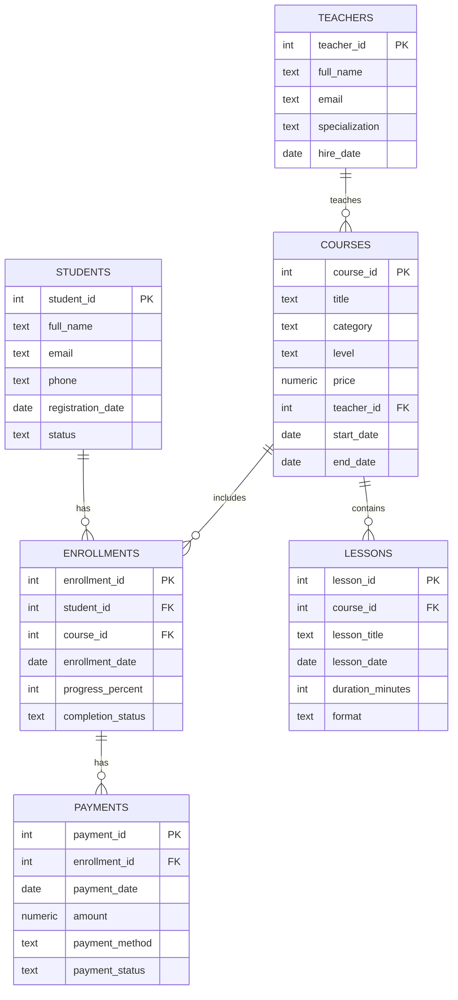

# ER-модель

```mermaid
erDiagram
  STUDENTS ||--o{ ENROLLMENTS : has
  COURSES ||--o{ ENROLLMENTS : includes
  TEACHERS ||--o{ COURSES : teaches
  COURSES ||--o{ LESSONS : contains
  ENROLLMENTS ||--o{ PAYMENTS : has

  STUDENTS {
    int student_id PK
    text full_name
    text email
    text phone
    date registration_date
    text status
  }

  TEACHERS {
    int teacher_id PK
    text full_name
    text email
    text specialization
    date hire_date
  }

  COURSES {
    int course_id PK
    text title
    text category
    text level
    numeric price
    int teacher_id FK
    date start_date
    date end_date
  }

  LESSONS {
    int lesson_id PK
    int course_id FK
    text lesson_title
    date lesson_date
    int duration_minutes
    text format
  }

  ENROLLMENTS {
    int enrollment_id PK
    int student_id FK
    int course_id FK
    date enrollment_date
    int progress_percent
    text completion_status
  }

  PAYMENTS {
    int payment_id PK
    int enrollment_id FK
    date payment_date
    numeric amount
    text payment_method
    text payment_status
  }
```